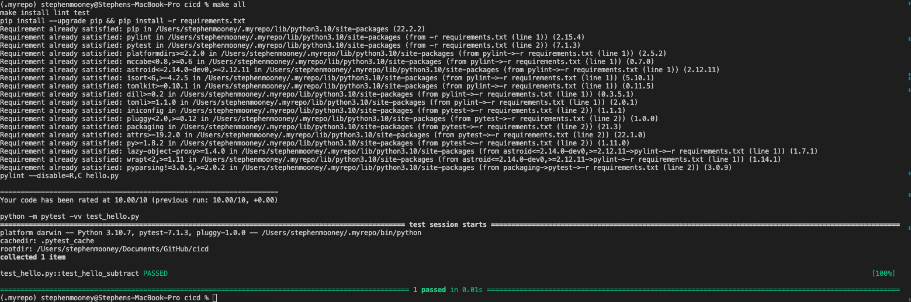

# Overview

This is a machine learning project using python which is kept in github and deployed using azure devops for some reason. Here is the running url of the app service.


https://mludacity.azurewebsites.net/

## Project Plan

https://docs.google.com/spreadsheets/d/1cekW8WX1FLk4G2xLEHb9KX8PcDbzl-VIJy5X0jaj8w0/edit?usp=sharing


* A link to a Trello board for the project
* https://trello.com/b/JiFQcatq/ml


* A link to a spreadsheet that includes the original and final project plan>

## Instructions

* 

<TODO:  Instructions for running the Python project.  How could a user with no context run this project without asking you for any help.  Include screenshots with explicit steps to create that work. Be sure to at least include the following screenshots:

* Project running on Azure App Service

* Project cloned into Azure Cloud Shell

* Passing tests that are displayed after running the `make all` command from the 

  Makefile`

* Output of a test run


* Successful deploy of the project in Azure Pipelines.  


* Running Azure App Service from Azure Pipelines automatic deployment


* Successful prediction from deployed flask app in Azure Cloud Shell.  [Use this file as a template for the deployed prediction](https://github.com/udacity/nd082-Azure-Cloud-DevOps-Starter-Code/blob/master/C2-AgileDevelopmentwithAzure/project/starter_files/flask-sklearn/make_predict_azure_app.sh).
  The output should look similar to this:

```bash
udacity@Azure:~$ ./make_predict_azure_app.sh
Port: 443
{"prediction":[20.35373177134412]}
```


* Output of streamed log files from deployed application

> 

## Enhancements

Refactor code into clean architecture

build, test and deploy from one provider not two.

Have develop, test and main branches and run these in deployment slots

Add backups to webapp in case of failure

## Demo 

https://www.screencast.com/users/stephen.peter.mo/folders/Snagit/media/47a78c38-2e04-4aef-9d58-bcb60557a0ba

